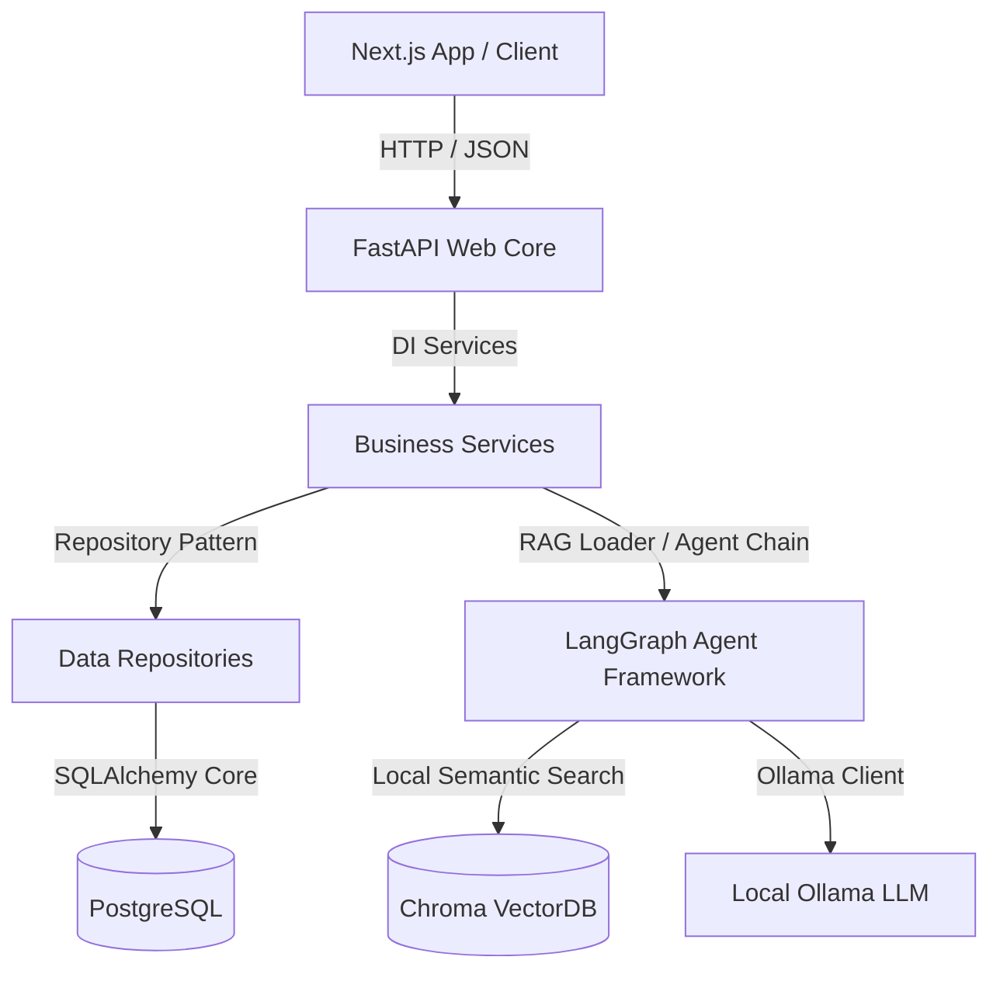

# AI-HRMS (AI-Powered Human Resource Management System)

An enterprise-grade, clean-architecture Human Resource Management System (HRMS) featuring automated assistant pipelines (LangGraph & Ollama), secure authentication (JWT), and real-time statistics dashboards.

---

## 🏛 System Architecture Overview

This monorepo utilizes a decoupled architecture style dividing browser clients, web controllers, persistent databases, and local LLM microservices.



### Key Architectural Guidelines
- **Strict Decoupling:** Routes in `backend/app/api` only receive parameters and return responses. Business calculations are isolated in `services/`.
- **Repository Pattern:** Database interactions are abstracted using repositories inside `backend/app/repositories/` to hide ORM implementation details from the business domain.
- **Modularity:** AI and RAG procedures reside inside `backend/app/ai/`, preventing LLM logic from scattering across databases or APIs.

---

## ⚙ Tech Stack

### Frontend
- **Framework:** Next.js (App Router, v14.2+)
- **Styling:** Tailwind CSS + Vanilla CSS Tokens
- **Animations:** Framer Motion + tailwind-animate
- **State/Types:** React Hooks + TypeScript (Strict Compiler)

### Backend & Database
- **API Engine:** FastAPI (Python 3.12+)
- **Database ORM:** SQLAlchemy v2.0
- **Migrations:** Alembic Migrations
- **Validator:** Pydantic v2
- **Linter/Formatter:** Ruff Code Standard
- **Databases:** PostgreSQL (Persistent) + ChromaDB (Vector Store)

### Artificial Intelligence
- **Workflows:** LangGraph (Stateful Multi-Agent chains)
- **Framework:** LangChain Integrations
- **Local Model Manager:** Ollama (default: `llama3.1:8b`)
- **Embeddings Model:** Sentence Transformers (`all-MiniLM-L6-v2`)

---

## 📁 Repository Structure

```
AI-HRMS/
├── .github/workflows/        # Automated GitHub Actions CI pipeline
├── backend/                  # FastAPI Application codebase
│   ├── app/                  # Application Modules
│   │   ├── api/              # API Route Controllers
│   │   ├── core/             # Application configs and JWT Security
│   │   ├── database/         # Database Sessions & Engines
│   │   ├── models/           # SQLAlchemy Data structures (ORM)
│   │   ├── schemas/          # Pydantic Schemas (Validation)
│   │   ├── repositories/     # Data Access Layer
│   │   ├── services/         # Pure Business rules layer
│   │   ├── middlewares/      # CORS and Rate Limit interceptors
│   │   ├── utils/            # Shared formatting helpers
│   │   └── ai/               # AI & Agent structures (LangGraph)
│   ├── tests/                # PyTest Automation Suites
│   ├── alembic.ini           # Alembic Database configuration
│   └── Dockerfile            # Multi-stage Python build
├── database/                 # Database Schema and Migrations
│   ├── migrations/           # Auto-generated Alembic versions
│   └── seeders/              # Startup DB seed data files
├── docs/                     # Architectural documentation & Mockups
├── docker/                   # Custom configuration containers scripts
├── scripts/                  # Shell Setup scripts
├── docker-compose.yml        # Multi-container local orchestra
└── README.md                 # Main Documentation
```

---

## 🚀 Setup & Execution Guide

### Prerequisite Checklist
- **Docker & Docker Compose** (Installed and running)
- **Node.js 18+ & Python 3.12+** (For local installations outside docker)

### Running the Complete Stack (Recommended)
1. Copy the environment variables:
   ```bash
   cp .env.example .env
   ```
2. Launch the services:
   ```bash
   docker compose up --build
   ```
3. Access the endpoints:
   - **Frontend application:** `http://localhost:3000`
   - **Backend API docs (Swagger):** `http://localhost:8000/docs`
   - **Ollama instance:** `http://localhost:11434`

---

## 🛠 Local Development Workflows

### Setup scripts
We provide automated setup scripts in `scripts/` to configure dependencies locally for development.

#### Windows
Run the PowerShell setup:
```powershell
.\scripts\setup.ps1
```

#### Linux/macOS
Run the Bash setup:
```bash
chmod +x ./scripts/setup.sh
./scripts/setup.sh
```

---

## 🌿 Git Workflow & Collaboration

To keep the repository clean during hackathon development:

1. **Branch Conventions:**
   - `main`: Production release state. Only direct merges via PR reviews.
   - `develop`: Development integration base.
   - `feature/<name>`: New modules or edits (e.g. `feature/auth`).
   - `bugfix/<name>`: Corrections (e.g. `bugfix/attendance-latency`).

2. **Commit Standard (Conventional Commits):**
   - `feat: add database schema for leave tracking`
   - `fix: correct token time validation checks`
   - `docs: update setup manual details`
   - `style: reformat dashboard sidebar components`

3. **Pull Request Protocol:**
   - Always open PRs against the `develop` branch.
   - Ensure the Github Actions CI check is green (checks for linting and test passes) before requesting a review.
